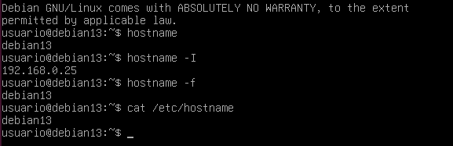
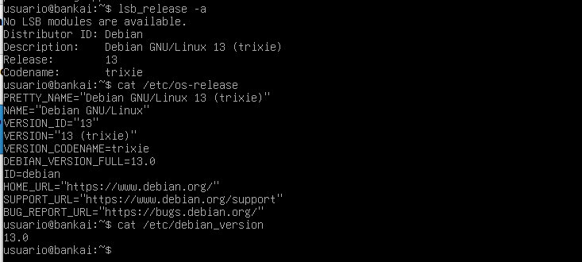
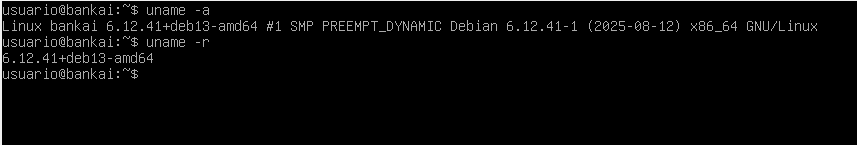
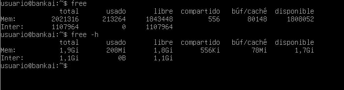
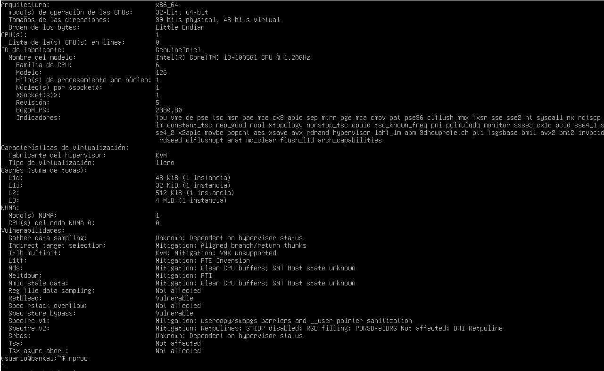
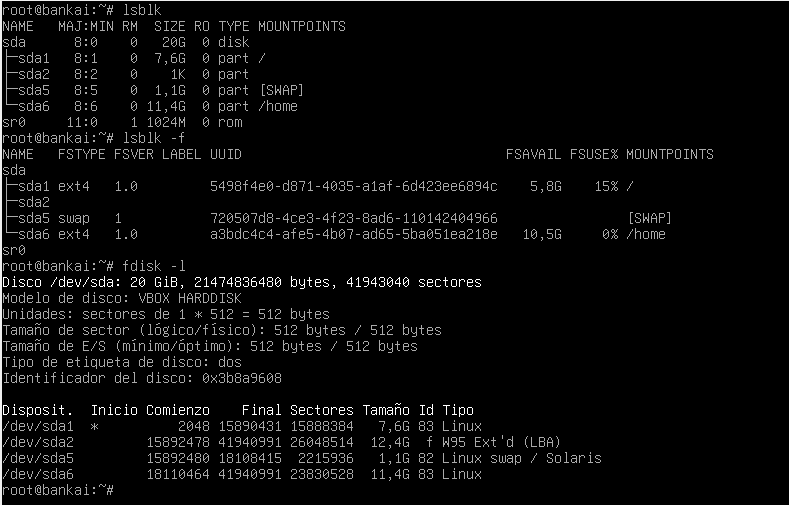
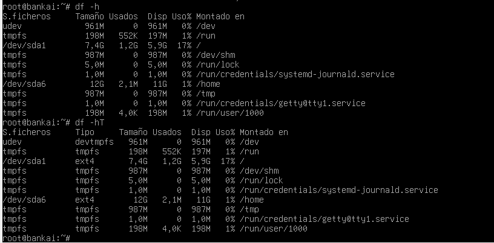
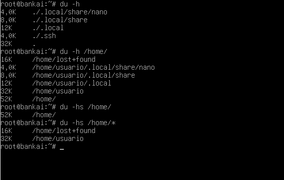

# 1. Conociendo el servidor Linux

> En este apartado se recogen las capturas de pantalla y los comentarios de cada ejercicio realizado.
> Las imágenes están en la carpeta `img/`. En algunas capturas se han destacado (subrayado o recuadro rojo)
> los elementos relevantes: nombre de la tarjeta, IP, estado `UP`, valores de memoria, particiones, etc.

---

## Hostname

Comandos y salidas:
- `hostname` → nombre corto del host.
- `hostname -I` → direcciones IP de la máquina.
- `hostname -f` → FQDN (si está configurado).
- `hostnamectl` → ver y cambiar hostname sin reiniciar.
- `cat /etc/hostname` → archivo con el nombre persistente.

**Capturas**

**Comentario**
> En la imagen se debe subrayar el *hostname* y la IP retornada por `hostname -I`. Si cambiaste el hostname con `hostnamectl set-hostname`, mostrar la captura `cambiar-hostname.png` y anotar que el cambio aparece en `/etc/hostname`.

---

## Versión del sistema

Comandos:
- `lsb_release -a`
- `cat /etc/os-release`

**Captura**

**Comentario**
> Resalta la `Description` y `Release` (o el campo `PRETTY_NAME`) que indica la versión de Debian/Ubuntu.

---

## Versión del kernel y arquitectura

Comandos:
- `uname -a`
- `uname -r`

**Captura**

**Comentario**
> Subrayar la versión del kernel (por ejemplo `5.x.x-...`) y la arquitectura (x86_64 / arm).

---

## Memoria RAM

Comandos:
- `free -h`

**Captura**

**Comentario**
> Marcar la columna `available` o la memoria total/used.

---

## CPU

Comandos:
- `lscpu`
- `nproc`

**Captura**

**Comentario**
> Destacar número de CPU lógicos y modelo.

---

## Discos y particiones

Comandos:
- `lsblk`
- `lsblk -f`
- `sudo fdisk -l` (si procede)

**Captura**

**Comentario**
> Subrayar las particiones principales y los puntos de montaje.

---

## Sistemas montados

Comandos:
- `df -h`
- `df -hT`

**Captura**

**Comentario**
> Señalar uso de disco en `/`, `/home` u otros puntos importantes.

---

## Tamaño de carpetas

Comandos:
- `du -h`
- `du -hs /home`
- `du -hs /home/*`

**Captura**

**Comentario**
> Indica qué carpetas consumen más espacio para justificar limpieza o backups.

---

## Usuarios y grupos

Comandos / ficheros:
- `getent passwd` (o `cat /etc/passwd`)
- `getent group` (o `cat /etc/group`)
- `getent shadow` (acceso restringido)

**Capturas**
- Usuarios: `img/usuarios-grupos-.1.png`
- Grupos: `img/usuarios-grupos-.2.png`
- Comandos getent: `img/usuarios-grupos-.3.png`
- Ejemplo de /etc/shadow (si procede): `img/usuarios-grupos-.4.png`

**Comentario**
> Subrayar usuarios importantes (p.ej. `root`, cuentas de servicio) y grupos con privilegios.

---

## Información de la red

Comandos:
- `ip a` → tarjetas, IPs, estado UP/DOWN.
- `ip r` → ruta por defecto (gateway).
- `ping -c 4 <puerta_enlace>`
- `ping -c 4 google.es`
- `nslookup google.es` / `nslookup 8.8.8.8` (comprobar servidor DNS)

**Capturas**
- Salida `ip a`: `img/info-red-1.png`
- `ip r` y gateway: `img/info-red-2.png`
- Configuración de red (ej. `/etc/network/interfaces`): `img/config-red.png`
- Reinicio de red: `img/reiniciar-red.png`
- Captura del inspector de red del navegador (solicitud, códigos y tiempos): `img/inspector-network.png`

**Comentario**
> En `ip a` subrayar la tarjeta de red (ej. `enp0s3`) y la IP asignada; en `ip r` subrayar la puerta de enlace.  
> En el inspector de red incluir la traza completa (orden, status HTTP, tamaño y tiempo) y marcar la petición principal (200/404/302).

---

## Archivos de configuración importantes

- `/etc/hostname`
- `/etc/network/interfaces` (si usaste configuración tradicional)
- `/etc/resolv.conf` (DNS)

**Comentario**
> Incluye capturas de esos ficheros en `img/` y subraya los `address`, `gateway` y `nameserver`.

---

## Observaciones finales

- Anota brevemente qué conclusiones sacas (por ejemplo: disco con poco espacio, la tarjeta `enp0s3` con IP correcta, kernel actualizado/no actualizado, etc.).
- Indica pasos siguientes (backup, limpieza, actualización del kernel, revisión de usuarios, etc.).

