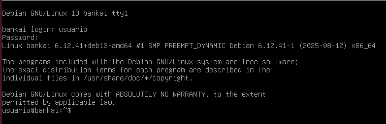
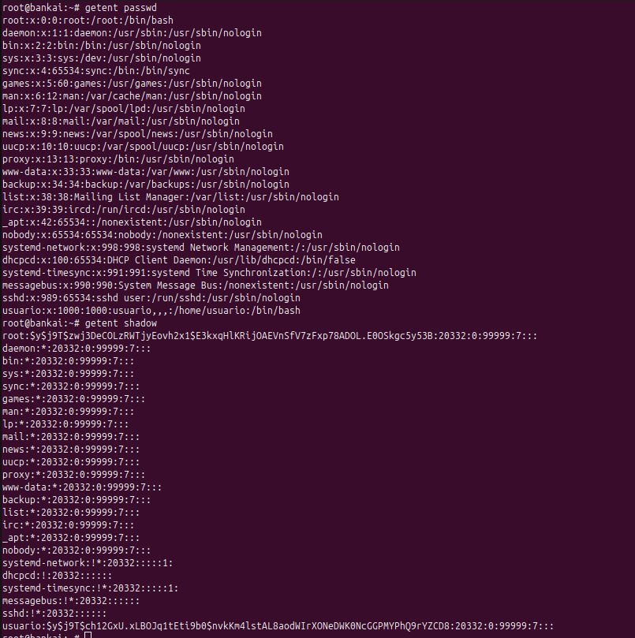
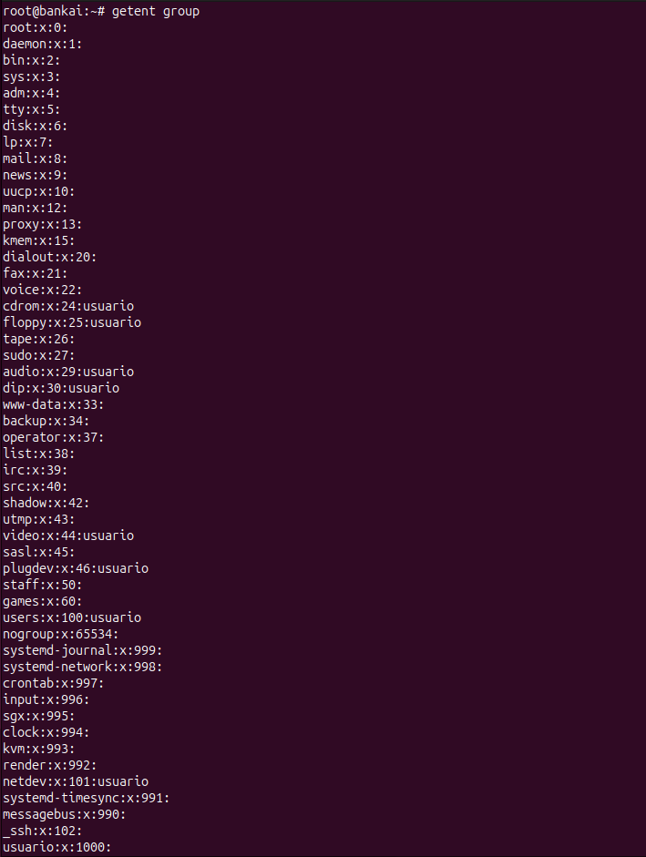
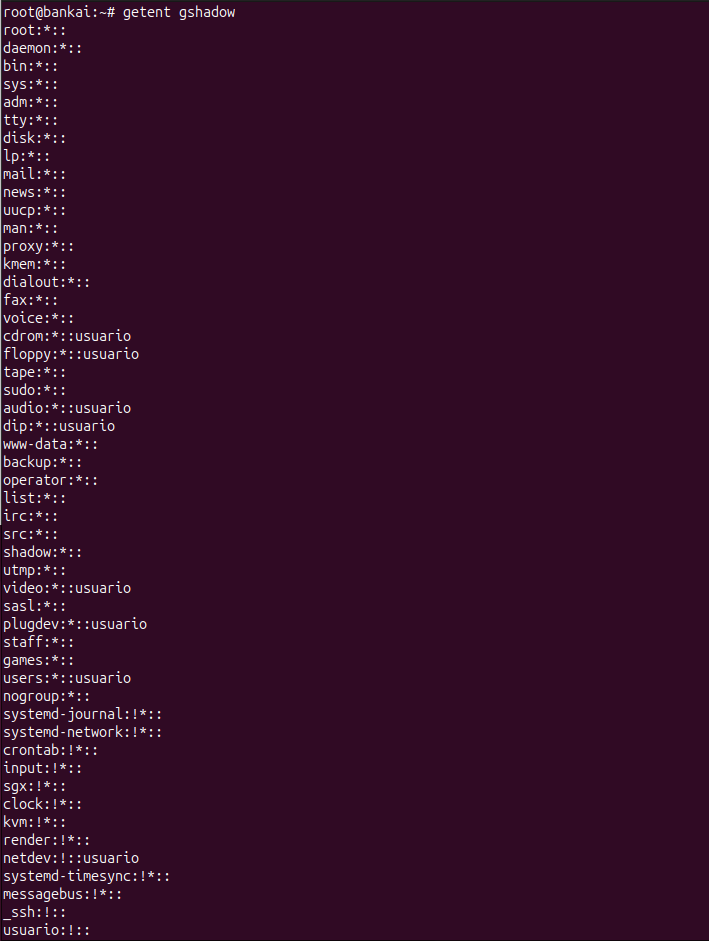
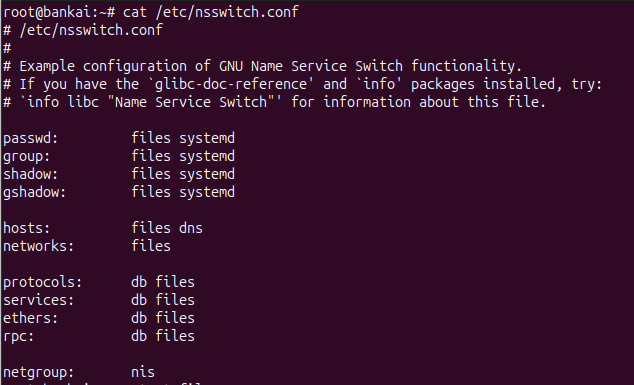
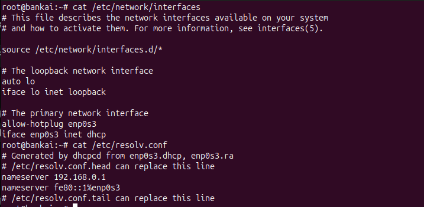
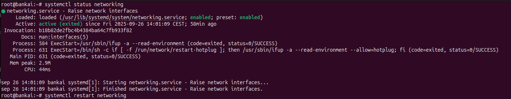

# 1. Conociendo el servidor Linux

> En este apartado se recogen las capturas de pantalla y los comentarios de cada ejercicio realizado.
> Las imágenes están en la carpeta `img/`. 
---

## Hostname

Comandos y salidas:
- `hostname` → nombre corto del host.
- `hostname -I` → direcciones IP de la máquina.
- `hostname -f` → FQDN (si está configurado).

**Captura**

**Comentario**
> Se ve el nombre de la máquina y sus direcciones IP.

---

## Cambio Hostname

- `hostnamectl` → ver y cambiar hostname sin reiniciar.
- `cat /etc/hostname` → archivo con el nombre persistente.

**Captura**
  
> Se observa el nuevo nombre configurado con `hostnamectl`.

---

## Versión del sistema

Comandos:
- `lsb_release -a`
- `cat /etc/os-release`
- `cat /etc/debían_version`

**Captura**

**Comentario**
> Indica la versión de Linux instalada.

---

## Versión del kernel y arquitectura

Comandos:
- `uname -a`
- `uname -r`

**Captura**

**Comentario**
> Se ve la versión exacta del kernel.

---

## Memoria RAM

Comandos:
- `free -h`

**Captura**

**Comentario**
> Se aprecia la memoria usada y disponible.

---

## CPU

Comandos:
- `lscpu`
- `nproc`

**Captura**

**Comentario**
> Se ven los núcleos y características del procesador.

---

## Discos y particiones

Comandos:
- `lsblk`
- `lsblk -f`
- `sudo fdisk -l` (si procede)

**Captura**

**Comentario**
> Se listan los discos y sus particiones.

---

## Sistemas montados

Comandos:
- `df -h`
- `df -hT`

**Captura**

**Comentario**
> Indica el espacio ocupado y libre en cada partición.

---

## Tamaño de carpetas

Comandos:
- `du -h`
- `du -hs /home`
- `du -hs /home/*`

**Captura**

**Comentario**
> Se ve cuánto ocupa cada directorio dentro de `/home`.

---

## Usuarios y grupos

Comandos / ficheros:
- `getent passwd` (o `cat /etc/passwd`)
- `getent group` (o `cat /etc/group`)
- `getent shadow` (acceso restringido)

**Capturas**
- Usuarios: 
- Grupos: 
- Comandos getent: 
- Ejemplo de /etc/shadow (si procede): 

**Comentario**
> Se observan las cuentas y grupos configurados.

---

## Información de la red

Comandos:
- `ip a` → tarjetas, IPs, estado UP/DOWN.
- `ip r` → ruta por defecto (gateway).
- `ping -c 4 <puerta_enlace>`
- `ping -c 4 google.es`
- `nslookup google.es` / `nslookup 8.8.8.8` (comprobar servidor DNS)

**Capturas**
- Salida `ip a`,`ip r` , gateway y pings: 
- Salida `nslookup google.es` / `nslookup 8.8.8.8`: 

**Comentario**
> En `ip a` subrayar la tarjeta de red (ej. `enp0s3`) y la IP asignada; en `ip r` subrayar la puerta de enlace.  
> En el inspector de red incluir la traza completa (orden, status HTTP, tamaño y tiempo) y marcar la petición principal (200/404/302).

---

## Configuración de la red

- `cat /etc/network/interfaces`
- `cat /etc/network/resolv.conf`

**Captura**
- Configuración de red (ej. `/etc/network/interfaces`): 

**Comentario**
> 

---

## Reinicio de red

- `systemctl status networking`
- `systemctl restart networking`

**Captura**
- Reinicio de red: 

---

## Configuración de la red: Otra forma

- `cat /etc/resolv.conf`

- Configuracíón de red(otra forma):  

**Comentario**
> Este archivo guarda los servidores DNS. Si tienes instalado resolvconf, se actualizará automáticamente según la configuración indicada.

